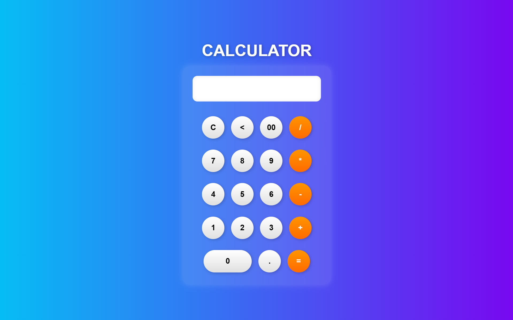

# 💻 Stylish Calculator

This is a **modern, stylish calculator** built using **HTML, CSS**. It features a sleek **glassmorphism design**, smooth button animations, and a fully functional arithmetic system.

## 🚀 Features

✅ **Modern UI** with a smooth gradient background  
✅ **Glassmorphism design** for a stylish look  
✅ **Clickable buttons** with hover effects  
✅ **Basic arithmetic operations** (+, -, ×, ÷)  
✅ **Responsive and easy to use**  

## 📸 Screenshot

 
